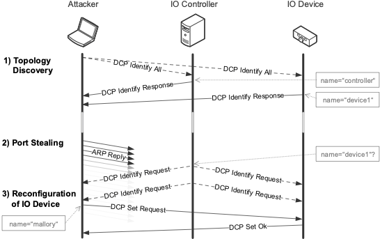
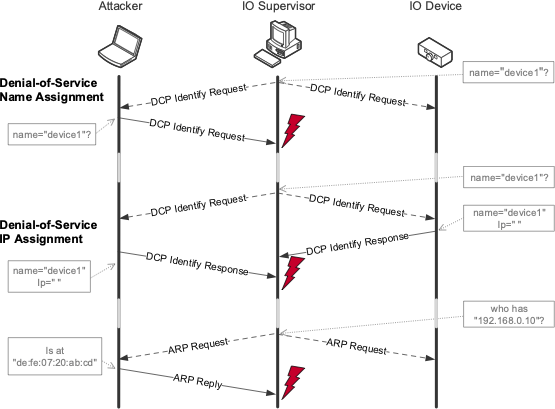

# Profinet IO  Denial of Service Attack

This repo provides the attack scripts that were used in my paper "No Need to Marry to Change Your Name! Attacking Profinet IO Automation Networks Using DCP" at DIMVA 2019.

## How does the attack work?

The attack presented here is a combination of four consecutive steps (see figure below). 
In the first step a preliminary exploration of the topology is required. 
Thereafter, a port stealing attack is launched to interrupt existing Application Relationships between the IO Controller and all IO Devices. Subsequently, a reconfiguration attack is triggered by means of a DCP Set request. 



To get the system up and running again the operator would need to reinstate the old system configuration. 
However, the fourth attack step prevents this by exploiting the DCP protocol behavior (see following figure). 
As the result, the affected IO Devices stop their operation. 



For more details, please have a look into the **[paper](paper/Mehner2019_No_Need_to_Marry_to_Change_Your_Name_Attacking_Profinet_IO_Automation_Networks_Using_DCP.pdf)**.

## How to Use 

### Requirements

- scapy (>2.4.0)

### Configuration

- we provide a sample config names `default_config.ini`. Please rename this file to `config.ini` and change the parameters so that it fits to your setup (e.g. target mac address) 

### 1. Topology Exploration

- preliminary step
- attacker sends DCP Identify request via multicast 
- every Profinet-enabled device return its identifying parameters  such as name, network configuration, vendor, and model (see below for an example)

```
> sudo identify.py

start sniffer
send DCP_IDENTIFY_REQUEST to enp2s0
.
Sent 1 packets.
{
    "20:87:56:90:1b:3e": {
        "device_id": "2571",
        "device_role": "IO Device",
        "device_vendor": "b'SCALANCE XC-200'",
        "gateway": "0.0.0.0",
        "ip": "192.168.1.3",
        "name_of_station": "b'mallory'",
        "netmask": "255.255.255.0",
        "vendor_id": "42",
        "vendor_name": "Siemens AG"
    },
    "ac:64:17:21:35:cf": {
        "device_id": "787",
        "device_role": "IO Device",
        "device_vendor": "b'ET200SP'",
        "gateway": "192.168.1.14",
        "ip": "192.168.1.14",
        "name_of_station": "b'et200sp'",
        "netmask": "255.255.255.0",
        "vendor_id": "42",
        "vendor_name": "Siemens AG"
    }
}
```

### 2. Port Stealing

- this step breaks the application relation between IO Device and IO Controller
- after that it is possible to change the name of the IO Device
- this step was necessary when attacking a Siemens ET200S
    - for all other devices the attack was successful even without this step

```
> sudo port_stealing.py
```


### 3. Reconfiguration Attack

- now the attacker can send a DCP Set Request that changes the name of the IO Device
- thereafter the IO Controller is not able to set up the application relation again

```
> sudo set_attack.py
```

- the only way to fix this, is to set the correct name again
- you can call the script with a string as first parameter to set this as name

```
> sudo set_attack.py et200sp
```

- Furthermore, you can also pass the mac address as a second parameter

```
> sudo set_attack.py et200sp 00:11:22:33:44:55
```


### 4. Persisent Denial of Service 

- this step can effectively prevent the IO Device from being named correctly again
- here we exploit the Profinet DCP specification, that no two devices may have the same name
- if any device is asking if a device name is already set (using DCP Identify Request), this script answers with the request device name (see more details in the paper)

```
> sudo dcp_identify_name_dos_attack.py
```

## 1-Click Attack

- this script conveniently executes all the scripts just described in the correct order
- just call the `identify.py` script to obtain the target's mac address and fill in at `config.ini`
- after that just execute the script

```
> sudo 1-click-attack.py
```


## Reference

You are free to use this code to stress your own hardware or for academic reasons, but please to not shot down any production system!

If you use the code in any way, please cite our DIMVA 2019 **[paper](paper/Mehner2019_No_Need_to_Marry_to_Change_Your_Name_Attacking_Profinet_IO_Automation_Networks_Using_DCP.pdf)**. Here is the bibtex:

Bibtex Entry:

```
@InProceedings{10.1007/978-3-030-22038-9_19,
author="Mehner, Stefan and K{\"o}nig, Hartmut",
editor="Perdisci, Roberto and Maurice, Cl{\'e}mentine and Giacinto, Giorgio and Almgren, Magnus",
title="No Need to Marry to Change Your Name! Attacking Profinet IO Automation Networks Using DCP",
booktitle="Detection of Intrusions and Malware, and Vulnerability Assessment",
year="2019",
publisher="Springer International Publishing",
address="Cham",
pages="396--414"
}
```

